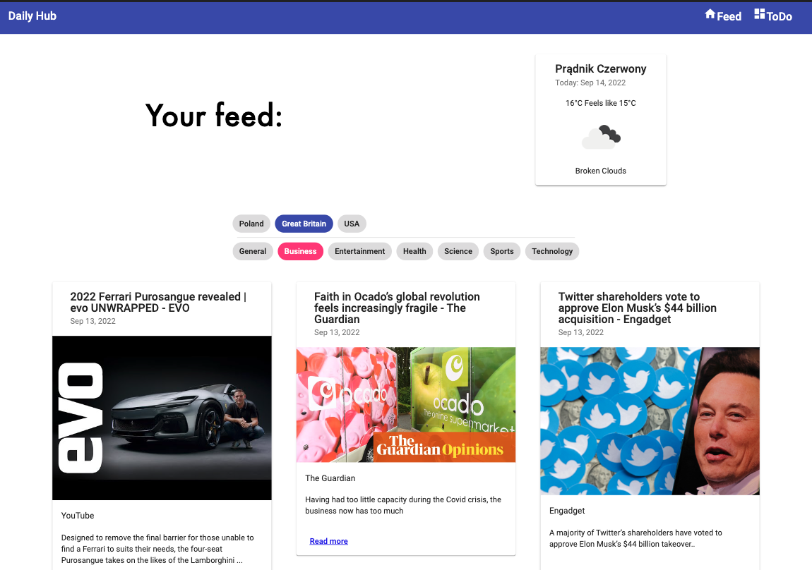

# Daily Hub

> Selected daily news and weather 
> Todo app for managing task

## Table of Contents

* [General Info](#general-information)
* [Technologies Used](#technologies-used)
* [Screenshots](#screenshots)
* [Setup](#setup)
* [Project Status](#project-status)
* [Room for Improvement](#room-for-improvement)
* [Contact](#contact)

## General Information

Daily Hub was created for personal use to aggregate news, weather status and todo in one place. The user can select the type and country of origin of the information, select the weather for a given place and manage his tasks

## Technologies Used

* This project was generated with [Angular CLI](https://github.com/angular/angular-cli) version 13.12.6.
* Using Angular Material Components
* Firebase realtime database

## Screenshots

### Main page of application

### Todo with drag'n drop

## Setup

Run `npm install` to load all necessary dependencies.
Run `ng serve` for a dev server. Navigate to `http://localhost:4200/`. The app will automatically reload if you change any of the source files.
Run `ng build` to build the project. The build artifacts will be stored in the `dist/` directory. Use the `--prod` flag for a production build.

## Project Status

Project is: _in progress_

## Room for Improvement

The next step in development is adding the ability to identify users by logging in

Room for improvement:

* JWT Authentication

To do:

* add the forecast
* some visual improvments

## Contact

Created by Patryk Król

[Linkedin](https://www.linkedin.com/in/patryk-krol/) or 📧 : patrtyk.krol.98@gmail.com
